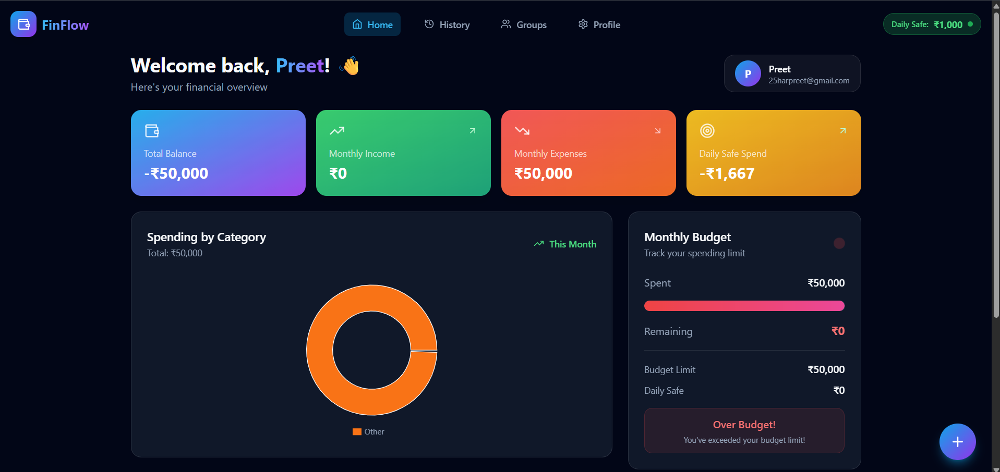
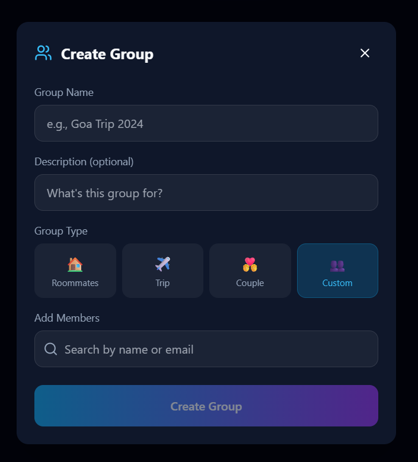
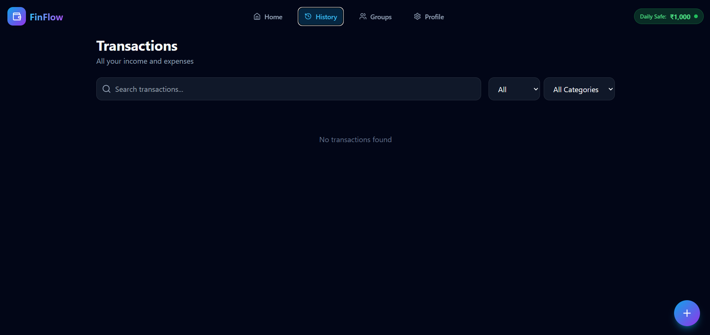
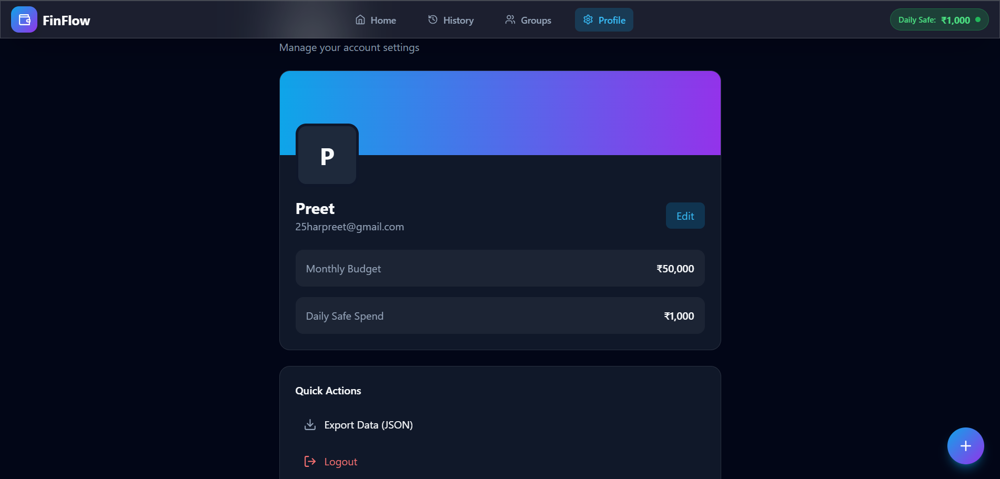

# 💰 FinFlow - Elite Expense Tracker

A high-end, responsive **MERN stack personal finance management application** for tracking expenses, managing budgets, splitting transactions, and analyzing spending.

FinFlow combines practical financial management features with a modern **glassmorphism UI**, smooth animations, and interactive data visualization.

---

## ✨ Features

### 💳 Transaction Management

- Add and manage income and expenses
- Categorize transactions
- Add notes and payment modes
- Search and filter transactions
- View transaction history
- Delete transactions

### 📱 SMS Parser

- Paste bank transaction SMS
- Automatically extract transaction details
- Detect transaction amount
- Identify merchant information
- Determine income or expense type using regex-based parsing

### 👥 Group Expense Splitting

- Create groups for roommates, trips, couples, or custom purposes
- Add group members
- Split shared expenses
- Track individual balances
- Calculate settlements
- Minimize the number of required transfers

### 📊 Budget & Financial Analytics

- Set monthly spending limits
- Track monthly income and expenses
- Monitor budget usage
- Calculate daily safe spending
- Visualize spending by category
- View financial statistics

### 🎨 Modern UI/UX

- Responsive design
- Glassmorphism-inspired interface
- Smooth page transitions
- Framer Motion animations
- Lottie animations
- Interactive charts
- CountUp number animations
- Modern floating action buttons
- Mobile-friendly layout

---

## 🖥️ Tech Stack

### Frontend

- React 18
- TypeScript
- Tailwind CSS
- Framer Motion
- Recharts
- Lucide React
- Lottie React
- React CountUp
- Vite

### Backend

- Node.js
- Express.js
- MongoDB
- Mongoose
- JWT Authentication
- Google OAuth

---

## 📸 Screenshots

### 🏠 Dashboard

The dashboard provides a complete financial overview including balance, income, expenses, spending categories, and monthly budget tracking.



---

### 👥 Create Group

Create expense-sharing groups for trips, roommates, couples, or custom purposes and add members to the group.



---

### 💳 Transactions

Search and filter income and expense transactions from a centralized transaction history.



---

### 👤 Profile

Manage account information, monthly budget settings, daily safe spending, data export, and account actions.



---

## 🚀 Getting Started

### Prerequisites

Make sure you have the following installed:

- Node.js 18+
- npm
- MongoDB (Local or MongoDB Atlas)
- Git

### 1. Clone the Repository

```bash
git clone https://github.com/25harpreet20111/Finflow.git
cd Finflow